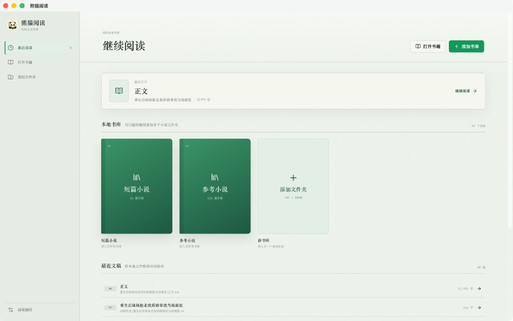
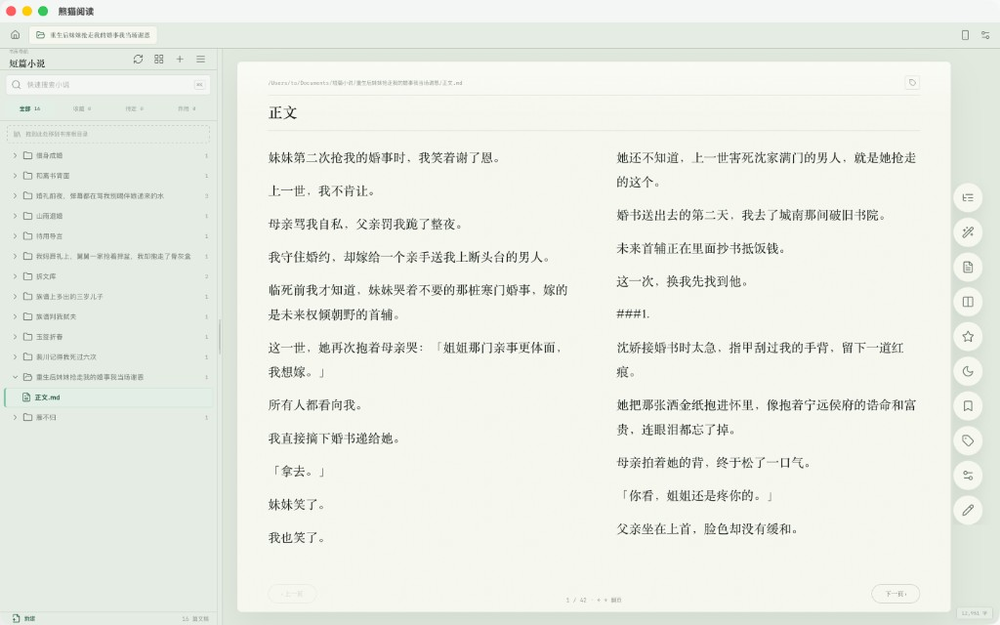

# Novalyte

<p align="center">
  <strong>本地优先的小说书库与沉浸式阅读器</strong>
</p>

<p align="center">
  简体中文 ｜ <a href="README.en.md">English</a>
</p>

Novalyte 是一款基于 Tauri 的桌面小说管理与阅读工具。它直接读取本地文件夹，不需要上传文稿，适合整理小说资料、阅读对标文稿、编辑正文与记录阅读进度。

## 应用预览

<p align="center">
  
  <br />
  <em>书库首页</em>
</p>

<p align="center">
  
  <br />
  <em>阅读界面</em>
</p>

## 主要功能

- **本地书库**：添加多个本地文件夹，自动扫描并维护目录树。
- **多种阅读格式**：支持 TXT、EPUB，以及命名为 `正文.md` 的 Markdown 文稿。
- **单栏与双栏阅读**：滚动阅读和双栏翻页可随时切换，阅读设置与工具条保持一致。
- **Markdown 渲染与编辑**：`正文.md` 阅读时按 Markdown 渲染，编辑时显示源码并自动保存。
- **手动分类**：使用「收藏 / 待定 / 弃用」整理文稿，可在目录树、卡片列表和手机端同步操作。
- **树与卡片双视图**：桌面侧栏支持目录树和正文预览卡片；手机端使用扁平卡片列表。
- **阅读偏好**：主题、字体、字号、行距、页面宽度、边距和亮度均可实时预览。
- **夜间主题**：使用中性墨灰阅读背景与暖灰正文，降低长时间阅读的视觉刺激。
- **阅读进度**：自动保存每篇文稿的阅读位置。
- **标签、批注与摘抄**：管理文稿标签，选中文本后保存批注或加入素材库。
- **手机扫码阅读**：同一局域网内扫码阅读，也可以选择 cloudflared 公网隧道；桌面和手机支持双向跟随。
- **Word 导出**：将 TXT 或 `正文.md` 直接转换为 DOCX，输出到源文件目录。
- **文件操作**：支持刷新、重命名、新建、移动和移到系统废纸篓。

## 文件收录规则

Novalyte 扫描书库时会收录：

- `*.txt`
- `*.epub`
- 文件名恰好为 `正文.md` 的 Markdown 文件

其他 Markdown 文件（例如 `设定.md`、`大纲.md`、`README.md`）不会出现在阅读列表中。

## Word 导出格式

阅读器工具条中的 Word 转换按钮会直接在源文件所在目录生成 `{小说标题}.docx`：

- 正文字体：宋体
- 正文字号：小四（12 pt）
- 行距：1.5 倍
- 正文首行缩进：2 字符
- 文档顶部：居中、加粗的小说标题
- `###1.`、`###2` 等章节行自动转换为「第一章」「第二章」
- 当源文件为 `正文.md` 或 `正文.txt` 时，父文件夹名称作为小说标题

同名 DOCX 已存在时会覆盖；如果文件正在被 Word 占用，应用会显示保存失败提示。

## 键盘操作

| 按键 | 单栏阅读 | 双栏阅读 |
| --- | --- | --- |
| `←` / `→` | 向上 / 向下翻一屏 | 上一页 / 下一页 |
| `↑` / `↓` | 按行滚动 | - |
| `PgUp` / `PgDn` | 切换上一篇 / 下一篇文稿 | 切换上一篇 / 下一篇文稿 |
| `⌘K` / `Ctrl+K` | 聚焦快速搜索 | 聚焦快速搜索 |

## 手机扫码阅读

1. 在桌面应用顶部点击手机图标。
2. 启动手机阅读服务。
3. 手机与电脑连接同一 Wi-Fi，并扫描二维码。
4. 在手机端选择书库和文稿进行阅读。

手机端会同步阅读进度和手动分类。桌面或手机打开另一篇文稿时，另一端会显示可跳转提示。

公网访问需要开启 cloudflared 隧道并输入桌面显示的配对码。访问令牌只保存在内存和已配对设备中；停止服务后需要重新扫码。

## 安装

可以在 GitHub Actions 的构建产物或项目 Release 页面下载对应平台安装包：

- macOS Apple Silicon（arm64）DMG
- macOS Intel（x64）DMG
- Windows x64 NSIS 安装程序

未签名的 macOS 构建首次打开时可能需要在「系统设置 → 隐私与安全性」中手动允许。

## 本地开发

### 环境要求

- Node.js LTS
- npm
- Rust stable
- Tauri 2 所需的系统依赖

### 安装依赖

```bash
npm ci
```

### 启动桌面应用

```bash
npm run dev
```

Vite 开发服务器默认监听：

```text
http://127.0.0.1:15620
```

### 仅启动 Web 前端

```bash
npm run dev:web
```

### 构建前端

```bash
npm run build:web-only
```

### 构建桌面安装包

```bash
npm run tauri build
```

### 检查与测试

```bash
npx tsc --noEmit
npm run build:web-only
cd src-tauri && cargo check && cargo test
```

## 技术栈

- Tauri 2
- Rust
- React 19
- TypeScript
- Vite
- Zustand
- SQLite / rusqlite
- CodeMirror
- marked + DOMPurify

## 数据与隐私

- 文稿默认只保存在用户选择的本地文件夹中。
- 索引、设置、标签、批注、素材和阅读进度保存在本地 SQLite 数据库中。
- Novalyte 不要求登录，也不会自动上传书库内容。
- 只有用户主动开启手机公网隧道时，阅读服务才会通过 cloudflared 暴露到公网。

## 项目状态

Novalyte 仍在持续开发中。建议在编辑重要文稿前保留独立备份，并在升级后先验证常用阅读和导出流程。
